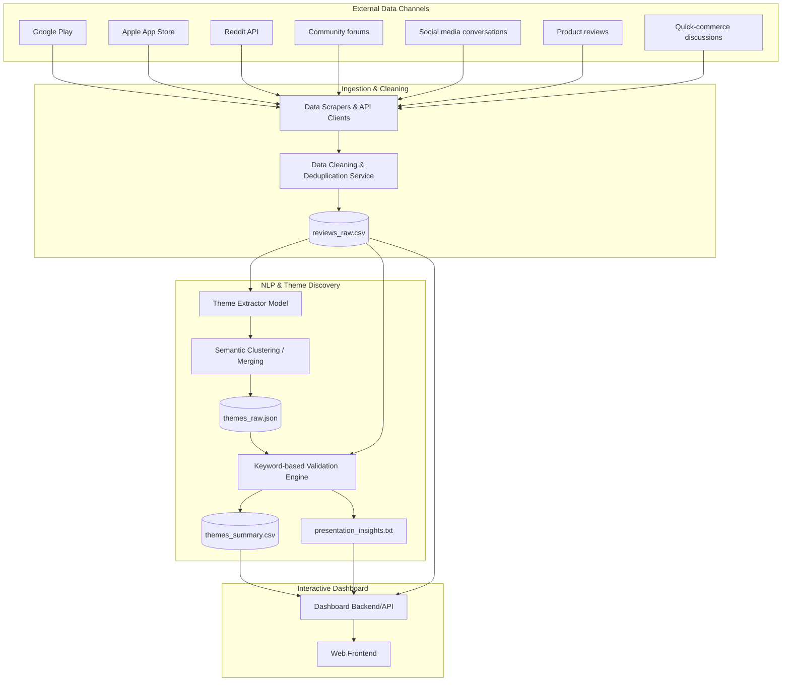

# Architecture: AI-Powered Discovery Engine for Quick Commerce (Blinkit)

> [!IMPORTANT]
> **System Goal:** A scalable data ingestion, NLP-based theme discovery, and interactive dashboard system to extract, analyze, and visualize user feedback across multiple public platforms for Blinkit product managers.

---

## 1. High-Level Architecture Overview

The system is designed as a batch-processing data pipeline connected to an AI-powered theme clustering engine and a frontend analytics dashboard.

---

## 2. Core Components

### 2.1 Data Collection Pipeline
A suite of specialized scrapers and API clients responsible for gathering large-scale, unstructured user feedback:
- **`google-play-scraper`:** Fetches reviews from Android users.
- **iTunes RSS Feed parser:** Fetches iOS reviews.
- **Reddit API Wrapper:** Queries relevant subreddits and comment threads.
- **Web Scrapers (e.g., BeautifulSoup / Playwright):** Scrapes Community forums, Social media conversations, Product reviews, and Quick-commerce discussions.
- **Resilience Module:** Handles API rate limiting (especially Reddit) and implements automatic retries and fallbacks.

### 2.2 Data Cleaning & Deduplication Engine
Cleans and standardizes incoming data before NLP processing.
- **Noise Filter:** Removes ads, empty records, and posts with fewer than six words.
- **Deduplicator:** Cross-references entries to remove duplicates and cross-posted content.
- **Standardizer:** Ensures all data is unified under a single schema (`source`, `date`, `rating`, `text`, `url`) in `reviews_raw.csv`.

### 2.3 AI Theme Discovery Engine
The core intelligence of the system, leveraging NLP for unstructured text analysis.
- **Extraction & Clustering:** Uses Large Language Models (LLMs) or clustering algorithms (e.g., BERTopic, Sentence Transformers) to discover recurring customer pain points and behaviors.
- **Semantic Merging:** Detects when identical issues (e.g., "delivery took too long" and "late order") are discussed across different platforms and merges them into a single canonical theme.
- **Ranking System:** Prioritizes themes based on frequency (occurrence count) and platform diversity (number of distinct sources).

### 2.4 Theme Validation Engine
Ensures that all AI-generated insights are grounded in hard evidence.
- Matches extracted theme keywords against the original text in `reviews_raw.csv`.
- Calculates an exact `validation_pct` (e.g., "42% of validated user discussions") to prevent AI hallucination.
- Aggregates findings into `themes_summary.csv` and auto-generates `presentation_insights.txt`.

### 2.5 Interactive Analytics Dashboard
A clean, minimal user interface designed for product managers.
- **Framework:** React/Next.js or Streamlit/Dash for rapid data visualization.
- **Search & Filtering:** Multi-facet search across keywords, themes, and sources.
- **Visualizations:** Bar charts for theme frequencies, distribution charts for sources, and temporal timelines.
- **Growth Insights Panel:** A dedicated view answering critical PM questions (e.g., "What prevents users from exploring new categories?", "What are the unmet customer needs?").

---

## 3. Technology Stack Guidelines
*(Note: As per non-functional requirements, all tools must be free and open-source.)*

- **Data Processing & Scrapers:** Python (Pandas, BeautifulSoup, google-play-scraper, praw)
- **AI/NLP Engine:** HuggingFace Transformers, Sentence-Transformers, or localized LLMs
- **Dashboard Backend:** FastAPI or Flask (if decoupled)
- **Dashboard Frontend:** React.js / Next.js / TailwindCSS 
- **Data Storage:** Local CSV and JSON files (designed for lightweight portability without requiring a heavy DBMS)

---

## 4. Execution Workflow

1. **Ingest Phase:** `run_collectors.py` triggers all scrapers.
2. **Clean Phase:** `clean_data.py` normalizes raw data and generates `reviews_raw.csv`.
3. **Discover Phase:** `extract_themes.py` analyzes the CSV and generates `themes_raw.json`.
4. **Validate Phase:** `validate_themes.py` calculates scores and outputs `themes_summary.csv` and `presentation_insights.txt`.
5. **Serve Phase:** `start_dashboard.sh` launches the local analytics server.

---

## 5. Setup & Deployment (To Be Defined in README)
- **Local/Cloud:** Can be deployed locally or hosted on lightweight cloud providers.
- **Environment:** Requires environment variables for LLM API keys (`.env` file).

---

## 6. Automated Data Refresh (Scheduler)
To keep the review data fresh by scraping and re-indexing automatically:
- **GitHub Actions Setup:** A GitHub Actions workflow (`.github/workflows/scheduler.yml`) schedules the data ingestion pipeline.
- **Timezone Configuration:** A `cron` trigger is configured to execute exactly at **10:00 AM IST** (04:30 UTC) every day.
- **Pipeline Execution:** The workflow automatically sets up Python, executes `run_collectors.py`, `clean_data.py`, `extract_themes.py`, and `validate_themes.py`, and then explicitly commits and pushes the updated `data/` folder back to the repository to persist the changes.
