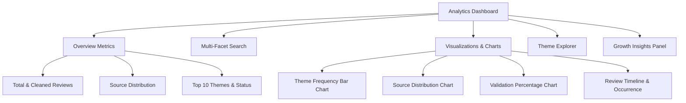

# AI-Powered Discovery Engine for Understanding User Shopping Behavior in Quick Commerce: A Growth Case Study for Blinkit

> [!IMPORTANT]
> **Project Goal:** Design and develop an AI-powered Discovery Engine that transforms large volumes of unstructured customer feedback into validated, actionable product insights for a Blinkit growth case study. By automatically collecting discussions from multiple public platforms, identifying recurring behavioral themes, validating them against raw evidence, and presenting the results through an intuitive dashboard, the system enables product managers to understand customer behavior, uncover unmet needs, prioritize product improvements, and support strategic growth decisions with data-driven evidence rather than intuition.

---

## 1. Background & Context

The quick-commerce industry in India has experienced rapid growth, with platforms such as **Blinkit**, **Zepto**, **Instamart**, and **BigBasket** competing to provide ultra-fast grocery and essentials delivery. While these platforms generate millions of user interactions across app stores, social media, online communities, and discussion forums, much of this feedback remains unstructured and difficult to analyze at scale.

For product managers, understanding:
- **Why users purchase repeatedly**
- **What drives category exploration**
- **What frustrations they experience**
- **What unmet needs remain**

...is essential for making data-driven product decisions. Manual analysis of thousands of reviews is time-consuming, inconsistent, and incapable of capturing emerging behavioral trends across multiple platforms.

---

## 2. Problem Statement

Design and develop an **AI-powered Discovery Engine** that automatically collects user-generated content related to Blinkit from multiple public sources and analyzes it to generate validated behavioral insights that can be used for product growth decisions in a Blinkit Product Management Case Study.

The system must gather large-scale user feedback across platforms, clean and deduplicate the data, identify recurring themes using AI/NLP, merge duplicate themes across different sources, validate findings against raw data, and present results through an interactive dashboard with supporting evidence and source citations.

---

## 3. Core Objectives

The discovery engine is designed to:
1. **Multi-Platform Data Collection**: Collect large-scale user feedback from multiple online platforms.
2. **Unified Dataset Creation**: Aggregate all collected data into a unified, standardized schema.
3. **Data Hygiene & Deduplication**: Remove duplicate, low-quality, and noisy records.
4. **AI-Driven Theme Discovery**: Identify recurring customer themes using AI/NLP techniques.
5. **Semantic Deduplication & Merging**: Group and merge semantically similar themes appearing across multiple sources.
6. **Multi-Source Ranking**: Rank themes by occurrence count and source diversity.
7. **Evidence-Based Validation**: Validate generated themes against the original dataset using keyword-based analysis.
8. **Actionable Insight Generation**: Generate presentation-ready growth recommendations backed by supporting quotes and citations.
9. **Interactive Dashboard**: Display all findings in an intuitive, searchable, and interactive analytics dashboard.

---

## 4. Target Data Sources

The system collects customer discussions, reviews, and feedback from seven distinct channels:

| Source | Description / Method |
| :--- | :--- |
| **Google Play Store Reviews** | Android app reviews collected via `google-play-scraper` |
| **Apple App Store Reviews** | iOS app reviews collected via iTunes RSS Review Feed |
| **Reddit Posts & Comments** | Subreddit posts and top comments collected via relevant search queries |
| **Community Forums** | Publicly available user discussions from tech/shopping forums |
| **Social Media Conversations** | Public discussions and sentiment across social channels |
| **Product Review Websites** | Third-party review aggregators and rating websites |
| **Quick-Commerce Forums** | Specialized discussion platforms focused on rapid delivery services |

---

## 5. Functional Requirements

### 5.1 Data Collection Pipeline
- **Automated Collection**: Scrape/fetch data using specialized scrapers and RSS feeds.
- **Unified Schema**: Standardize and store collected data into `reviews_raw.csv` with the following columns:
  - `source`: Originating platform (e.g., Google Play, Reddit)
  - `date`: Timestamp of the review or comment
  - `rating`: Numeric rating (if applicable)
  - `text`: Raw user feedback or discussion text
  - `url`: Direct link or identifier to the source

### 5.2 Data Cleaning & Filtering
To ensure high signal-to-noise ratio, the cleaning engine must:
- Remove duplicate reviews and cross-posted discussions.
- Filter out advertisements, promotional spam, and irrelevant posts.
- Remove empty records or entries containing fewer than **six words**.
- Normalize whitespace, text encoding, and formatting.
- Preserve source information for traceability.
- **Target Cleaned Dataset Size**: **1,500+ unique reviews/discussions**.

### 5.3 Theme Discovery & Clustering (AI/NLP)
- **Theme Extraction**: Identify recurring customer themes, sentiment drivers, and behavioral patterns.
- **Semantic Grouping**: Group semantically similar themes together.
- **Cross-Source Merging**: Merge duplicate themes from different platforms.
- **Intermediate Storage**: Save raw discovered themes into `themes_raw.json`.

### 5.4 Theme Aggregation & Ranking
For every merged theme, aggregate metadata into `themes_summary.csv` containing:
- `Theme name`: Concise title representing the cluster
- `Description`: Detailed explanation of the theme
- `Frequency count`: Total number of occurrences across the dataset
- `Source count`: Number of distinct sources where the theme appeared
- `Example customer quotes`: Representative quotes with citations

**Ranking Logic**: Rank themes by total frequency and number of distinct sources, highlighting the **Top 10 recurring themes**.

### 5.5 Keyword-Based Theme Validation
To ensure insights are evidence-based rather than AI hallucinations:
1. Match keywords associated with each theme against the raw dataset (`reviews_raw.csv`).
2. Calculate `validation_pct` (the exact percentage of reviews discussing or referencing each theme).
3. Append `validation_pct` directly to `themes_summary.csv`.

### 5.6 Insight Generation
Generate concise, presentation-ready insights for top themes.
- **Example Output**: *"Delivery reliability remains the strongest driver of customer loyalty, appearing in 42% of validated user discussions."*
- **Required Fields**: `Theme`, `Insight sentence`, `Validation percentage`.

### 5.7 Automated Data Refresh (Scheduler)
To keep the review data and extracted themes fresh, the system must support automated ingestion:
- **GitHub Actions Workflow**: A scheduled pipeline (`.github/workflows/scheduler.yml`).
- **Timezone Configuration**: Scheduled to execute exactly at **10:00 AM IST** (04:30 UTC) every day.
- **Pipeline Execution**: The workflow will automatically set up the environment, run the collection, cleaning, and extraction scripts, and persist the updated data files back to the repository.

---

## 6. User Interface Requirements (Interactive Dashboard)

Develop a clean, minimal, and responsive analytics dashboard enabling product managers to explore findings:



### 6.1 Dashboard Components
- **Metrics Overview**: Total reviews collected, reviews by source, top themes, validation percentages, processing status, and recent reviews.
- **Search & Filtering**: Filter reviews and discussions by keyword, theme, or data source.
- **Visualizations**:
  - Theme frequency bar chart
  - Source distribution breakdown
  - Keyword validation score comparisons
  - Temporal review timeline across platforms
- **Theme Explorer**: Interactive view displaying theme descriptions, supporting quotes, source counts, validation scores, and raw example reviews.
- **Growth Insights Panel**: Dedicated area addressing critical PM questions:
  - *Why do users repeatedly buy from specific categories?*
  - *What friction points prevent category exploration?*
  - *How do users discover new products on the platform?*
  - *What shopping habits and routines emerge repeatedly?*
  - *What information do users need before trying a new category?*
  - *What operational or UX frustrations occur most frequently?*
  - *Which user segments experiment with new offerings?*
  - *What unmet customer needs consistently appear?*
  - *Which product expansion opportunities are most promising?*

---

## 7. Non-Functional Requirements

- **Open-Source Only**: Rely strictly on free and open-source Python/Node/JS libraries and tools.
- **Resilience & Fallbacks**: Handle API failures gracefully with automatic retries, rate-limit handling (especially for Reddit API), and fallback to alternate channels when needed.
- **Reproducibility**: Ensure deterministic cleaning and reproducible validation scores across runs.
- **Clean Architecture**: Maintain modular code organization with structured logging (`logs/`) for debugging.
- **Scalability**: Capable of processing thousands of reviews with sub-second dashboard query performance.

---

## 8. Expected Outputs & Project Artifacts

```
c:/BlinkitReviewAnalyser/
├── reviews_raw.csv              # Unified raw & cleaned dataset across all sources
├── themes_raw.json              # AI-generated intermediate themes and clusters
├── themes_summary.csv           # Aggregated, ranked, and validated themes
├── presentation_insights.txt    # Executive summaries and presentation-ready insights
├── dashboard/                   # Interactive dashboard application codebase
├── charts/                      # Exported visualization charts and figures
└── logs/                        # Processing and execution logs
```

---

## 9. Success Criteria

The project is considered successful if it:
1. Collects **1,500+ genuine and unique** user discussions across multiple public platforms.
2. Successfully integrates app store APIs, social scraping, and community discussions.
3. Identifies meaningful, actionable behavioral themes using AI/NLP.
4. Produces validated, evidence-backed insights supported by exact validation percentages.
5. Includes supporting customer quotes with transparent source citations.
6. Generates presentation-ready growth recommendations for Blinkit product managers.
7. Delivers an intuitive, clean, and user-friendly web dashboard.

---

## 10. High-Level System Workflow

```mermaid
flowchart TD
    subgraph Sources [Public Data Sources]
        GP[Google Play Store]
        AS[Apple App Store]
        RD[Reddit API / Posts]
        CF[Community Forums]
        SM[Social Media Data]
        PR[Product Review Sites]
        QC[Quick-Commerce Forums]
    </subgraph>

    Sources --> Pipeline[Data Collection Pipeline]
    Pipeline --> Cleaning[Data Cleaning & Filtering\n(Deduplication, Noise Removal, Word-count filter)]
    Cleaning --> Unified[reviews_raw.csv\n(1,500+ Cleaned Records)]
    
    Unified --> Discovery[AI Theme Discovery Engine]
    Discovery --> Merging[Theme Merging & Clustering]
    Merging --> RawThemes[themes_raw.json]
    
    RawThemes --> Ranking[Theme Frequency & Source Ranking]
    Unified ---> Validation[Keyword-Based Theme Validation]
    Ranking ---> Summary[themes_summary.csv]
    Validation ---> Summary
    
    Summary --> Insights[Presentation-Ready AI Insights\n(presentation_insights.txt)]
    Insights --> Dashboard[Interactive Analytics Dashboard]
```
